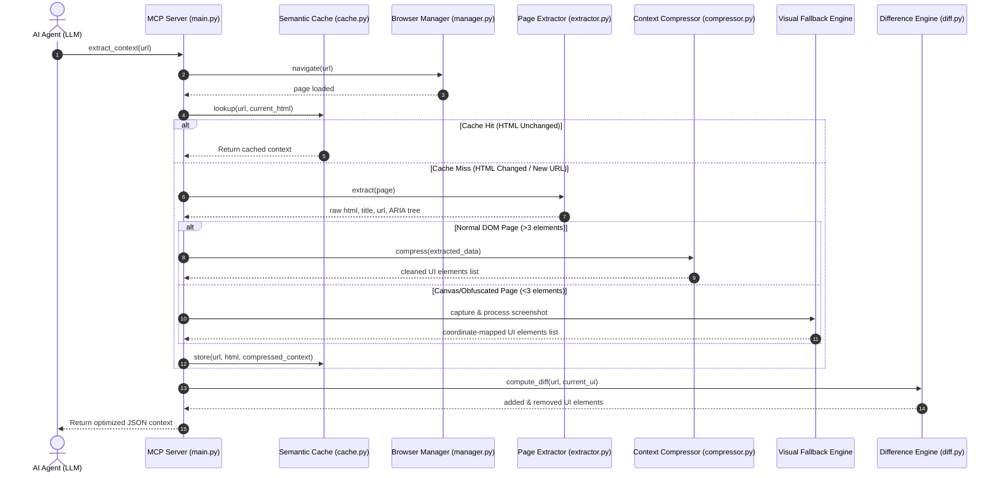

# Technical Proposal: Browser Optimizer MCP

## 1. Idea and Proposed Solution

### 1.1 Describe the Idea
The **Browser Optimizer MCP** is an intelligent, high-efficiency middleware layer built on top of **FastMCP** and **Playwright**. It sits directly between LLM-driven autonomous agents and web browser automation frameworks. Its primary goal is to optimize browser interactions by compressing DOM trees, caching states, dynamically classifying pages, calculating element differences (deltas), and providing a visual fallback pipeline for canvas-heavy or dynamic pages. This turns a normally verbose, latency-heavy visual or HTML-based task into a streamlined, token-efficient, and deterministic JSON-RPC interface.

### 1.2 How is the Problem Approached?
The middleware approaches web browser interaction by treating the web page not as a massive document of styling, scripts, and layouts, but as a state-based collection of interactive controls. The pipeline works as follows:
1. **Intake & Navigation:** The AI agent triggers a standardized MCP tool. The browser manager resolves the target tab context.
2. **Context Compression & Visual Fallback:** The DOM is stripped of advertisements, visual styling, script tags, SVG parameters, and structural fluff. If the page contains fewer than 3 interactive elements (indicating canvas-heavy views, maps, or obfuscated SPAs), the system triggers the **Visual Fallback Engine**—taking a compressed screenshot and passing it to a multimodal vision API to reconstruct the interactive element registry.
3. **Semantic Caching:** An exact HTML match signature is calculated using `xxhash` to retrieve cached states in under 1ms. For similar pages with slight text variations, a topological structural embedding is compared using cosine similarity.
4. **State Classification:** Structural heuristics and local ML models (such as LightGBM) automatically classify the page category (e.g., `LOGIN`, `SEARCH`, `CHECKOUT`).
5. **Delta Diffing:** Successive page observations are compared, returning only newly added or removed elements rather than the whole layout.
6. **Execution & Replay:** Replayable macros execute mouse/keyboard events with confidence-based routing and automated error recovery.

### 1.3 Why is this Problem Important or Relevant? Who is Affected by this Issue?
Autonomous agents are increasingly handling complex, multi-step browser workflows like form filling, quality testing, price tracking, and web scraping. However, raw web pages are designed for human eyes, not LLM consumption.
* **Who is Affected:**
  * **AI Engineers & Developers:** Building agentic workflows that hit prompt limits or become cost-prohibitive.
  * **Businesses Deploying AI Agents:** Facing high operational API inference costs (often $0.50 to $1.00+ per browser step).
  * **End Users:** Experiencing long execution delays (30s+ per action) because the LLM is digesting massive HTML contexts.
* **Relevance:** Solving this bottleneck is critical to making real-time, autonomous web agents economically viable and fast enough for consumer-facing applications.

---

## 2. Technical Approach

### 2.1 Technologies Used
The system is built on a modern, lightweight, and performant python stack:
* **Core Framework:** Python 3.11+
* **Browser Automation:** Playwright (Python async API)
* **Protocol Standard:** Model Context Protocol (FastMCP)
* **Caching:** SQLite (persistent database) and `cachetools.TTLCache` (in-memory)
* **Vision Fallback:** Multimodal Vision APIs (Gemini Flash / Claude Sonnet) for coordinate parsing
* **Hashing & Similarity:** `xxhash` (64-bit hashing), Scikit-Learn / NumPy (embeddings & cosine similarity)
* **Machine Learning:** LightGBM (lightweight page classification)
* **Observability:** WebSockets (streaming delta-diff watch mode)

### 2.2 Process of Implementation (Architecture & Flow)

The interaction flow between the AI Agent, MCP Server, and Browser is illustrated below:

### 2.3 Key Features (Technical)
* **Context Compression Engine:** Strips irrelevant structural details, resulting in **80% to 98% token reduction** (e.g., shrinking a 52,000-token Google Search DOM to ~120 tokens).
* **Visual Fallback Pipeline:** Gracefully handles canvas-heavy pages or dynamic SPAs by capturing a screenshot, compressing it (JPEG 70% quality), sending it to a multimodal API, and returning coordinate-mapped selectors matching the standard element schema.
* **Double-Tier Caching:** Combines exact HTML xxhash fingerprinting with semantic layout similarity matching to recognize template-based duplicate pages.
* **Delta Difference Calculator:** Computes and sends only the modifications between sequential interactions.
* **Confidence-based Routing:** Macros or cached sequences are run based on confidence metrics, falling back to manual LLM reasoning only when verification fails.
* **WebSocket Push Streaming:** Allows clients to monitor and receive page state diffs automatically via a WebSocket server.
* **Progressive Tool Disclosure:** Dynamically hides verbose schema specs until the client specifically requests them, optimizing startup protocol overhead.

---

## 3. Feasibility and Overall Impact

### 3.1 Analysis of Feasibility
The project is highly feasible and cost-effective because it avoids self-hosted large language models or massive cloud infrastructure. It leverages lightweight Python packages and SQLite, meaning it runs with zero database configurations and consumes minimal RAM/CPU resources. The local browser instance is controlled through Playwright's headless API, making it easy to package inside a Docker container.

### 3.2 Potential Challenges and Risks
1. **Dynamic Content and Hydration:** Modern frameworks (React, Angular) update the DOM asynchronously, occasionally causing the compression engine to capture half-loaded pages.
2. **Anti-Bot Shielding:** Sophisticated protection suites (Cloudflare, Akamai) easily block headless browsers.
3. **Fragile Action Paths:** If a page layout changes slightly, saved click paths (macros) might target the wrong selectors.

### 3.3 Strategies for Overcoming Challenges
* **Stabilization Checks:** Implement wait heuristics in `wait_until_ready` that monitor network idle times and DOM mutation observers.
* **Stealth Integration:** Utilize Playwright stealth parameters, rotating user-agents, and residential proxies to bypass security gates.
* **Action Replay Verification:** Verify the state after each step of a macro replay, falling back to LLM reasoning if the expected element disappears.

### 3.4 Scalability and Real-World Application
This system scales easily since browser sessions are isolated inside separate browser contexts (`browser.new_context()`), maintaining strict session separation (cookies, localStorage) for multi-tenant setups. In the real world, this middleware is applied directly in:
* Automated e-commerce checkouts and price trackers.
* Continuous Integration and UI regression testing suites.
* High-volume RPA (Robotic Process Automation) applications.

---

## 4. Conclusion, References, and Future Enhancements

### 4.1 Impact on Target Audience
By reducing token usage by up to 98%, developers can build agents that operate at 1/10th of the previous API cost. Execution speeds are reduced from seconds to milliseconds for cached navigations, translating to a snappier, more reliable experience for end users.

### 4.2 Conclusion
The **Browser Optimizer MCP** successfully addresses the most painful bottlenecks in LLM browser automation: high cost, high latency, and low reliability. By serving as an intelligent, caching, and compressing middleware layer, it converts the complex, noisy web into clean, structured data suited for AI agents.

### 4.3 Future Enhancements
* **Federated Cross-Agent Swarm Memory:** Establish a secure, zero-knowledge federated network of browser optimizers. Agents can share anonymized, structurally encrypted layout schemas and successful interaction paths (macros) globally. If one agent solves a complex checkout flow on a new platform, all other instances globally instantly gain layout recognition and template navigation without sharing sensitive payload contents.
* **Cognitive Self-Healing Interaction Paths:** Implement on-edge reinforcement learning loops (utilizing GRPO/RLAIF style monitoring) that observe execution failures (e.g. broken selectors). When a selector fails due to website revisions, a background mini-LLM is spawned to examine the visual context and ARIA tree. It calculates layout mutations, generates a corrected path selector, repairs the SQLite macro signature in real-time, and adjusts confidence parameters, requiring zero developer maintenance.
* **Swarm-Scale Parallelized Execution:** Support distributed browser execution where complex tasks are decomposed by the optimizer. The system spins up parallel, isolated headless worker sessions across multi-region proxies to crawl, populate forms, or execute actions concurrently, resolving race conditions and consolidating the states back into a single unified context.
* **Neuromorphic Vision-Grid Interfacing:** Integrate an ultra-lightweight, local neuromorphic vision system (edge-run YOLO/Florence-2 fine-tuned model) that bypasses HTML parsing entirely. It treats the viewport as a canvas of visual heatmaps, predicting interactable coordinates directly from visual indicators (outlines, hover responses, button shapes) to achieve cognitive human-like browser speed.
* **Advanced CAPTCHA and Stealth Shields:** Build dynamic canvas fingerprinters, residential proxy rotators, and third-party solver APIs directly into the execution module.

### 4.4 References
1. **Model Context Protocol (MCP):** [Anthropic MCP Specifications](https://modelcontextprotocol.io)
2. **Playwright Browser Automation:** [Microsoft Playwright docs](https://playwright.dev)
3. **FastMCP Wrapper:** [FastMCP Framework](https://github.com/jlowin/fastmcp)
4. **LightGBM Classifier:** [LightGBM Documentation](https://lightgbm.readthedocs.io)
