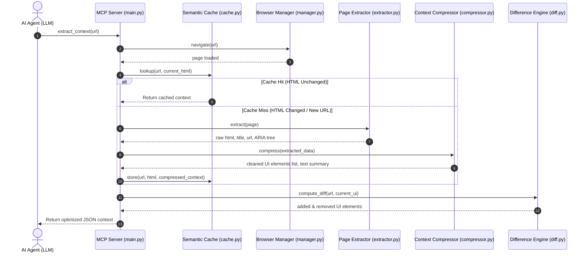

# Browser Optimizer MCP

[](https://pypi.org/project/browser-optimizer-mcp/)
[](https://www.python.org/downloads/)
[](LICENSE)

An optimization middleware layer built on top of **FastMCP** and **Playwright**. It sits between AI agents (LLMs) and browser automation frameworks to drastically reduce token usage, execution latency, and API inference costs while maintaining high accuracy for browser workflows.

## Features

- **Drastic Token Reduction**: Reduces LLM token usage by up to 98% by filtering out non-essential HTML elements.
- **Smart Element Extraction**: Identifies and extracts only interactive UI components (buttons, links, inputs).
- **Semantic Caching**: Implements fast in-memory caching using xxhash for instant page state retrieval.
- **Delta Diffing**: Computes and returns only the changes between consecutive page states.
- **Automated Classification**: Categorizes pages dynamically based on structural heuristics.

## Quick Install

```bash
pip install browser-optimizer-mcp
browser-optimizer install
```

The `install` command automatically performs the following setup:
- Checks the local Python version (requires >= 3.11).
- Installs Playwright browser binaries (`chromium`).
- Detects **Claude Desktop** and automatically configures its MCP integration.
- Detects **Antigravity IDE** and automatically configures its MCP integration.
- Provides manual configuration instructions for **Cursor**.
- Verifies the installation process end-to-end.

Once installed, initiate the server using:

```bash
browser-optimizer start
```

> **Note:** Execute `browser-optimizer doctor` at any time to run diagnostic checks on your environment.

---

## How It Works & Process Flow

### 1. Execution Pipeline
When an AI agent requests context from a web page, the optimizer executes the following sequence:
1. **Request Intake**: The AI agent invokes `extract_context` with a target URL.
2. **Browser Navigation**: The browser manager acquires a Playwright page instance and navigates to the specified URL.
3. **Markup and Accessibility Capture**: The extraction module retrieves the raw HTML markup and generates a semantic ARIA snapshot of the document body.
4. **State Fingerprinting**: The semantic cache applies an xxhash algorithm to the raw HTML to uniquely identify the page state.
   * **Cache Hit**: If the hash matches an existing signature, the server returns the cached context in under 1ms, bypassing DOM parsing.
   * **Cache Miss**: For new or modified pages, the extraction process proceeds.
5. **Context Compression**: The compression module filters out styling, scripts, SVGs, and boilerplate structural elements (headers, footers). It isolates interactable components such as buttons, inputs, dropdowns, and links.
6. **Task Classification**: A rule-based classifier evaluates the interactive elements to determine the page category (e.g., login, product search, checkout).
7. **Delta Diff Calculation**: The difference engine compares the current UI elements against the last observed state, returning only the added or removed components.
8. **Metrics Logging**: The metrics subsystem records data volume, compressed sizes, and efficiency ratios.
9. **Payload Delivery**: A streamlined JSON payload containing the optimized UI elements, ARIA snapshot, and page metadata is returned to the requesting agent.

### 2. Process Flow Diagram


---

## Primary Use Cases

The Browser Optimizer MCP is designed to facilitate various AI-driven automation workflows:

1. **Cost Optimization for AI Agents**: Lowers token consumption on complex web pages (such as e-commerce platforms or social media feeds) by up to 98%, significantly reducing LLM API expenses.
2. **Structured Data Extraction**: Enables LLM-based scrapers to identify and extract content efficiently without parsing scripts, styles, or excessive HTML nesting.
3. **Automated UI and End-to-End Testing**: Facilitates rapid assertion checks on UI changes by leveraging delta diffing to identify structural regressions.
4. **Intelligent Form Automation**: Supplies clean, interactive element trees, allowing agents to populate forms, authenticate, or interact with custom components seamlessly.
5. **Real-time Page Monitoring**: Observes active pages for updates using delta diffing, alerting agents only when relevant interactive components change.
6. **Web Search and RAG Pipelines**: Functions as an efficient crawler that removes boilerplate content and provides refined context for Retrieval-Augmented Generation workflows.
7. **Accessibility Audits**: Exposes semantic ARIA accessibility trees, enabling automated agents to perform compliance inspections.
8. **E-Commerce Monitoring**: Navigates product catalogs, categorizes page types, and extracts pricing or inventory updates with minimal data transfer.
9. **Dynamic Single Page Application (SPA) Support**: Manages modern JavaScript-heavy frameworks by executing Playwright locally, caching states, and delivering processed components.
10. **Multi-Agent Session Sharing**: Acts as a standardized MCP integration layer for multi-agent systems, allowing distinct agents to share and interact with a unified browser session.

---

## MCP Tools Reference

The server exposes the following tools to the Model Context Protocol environment:

| Tool | Parameters | Return Type | Description |
| :--- | :--- | :--- | :--- |
| `extract_context` | `url` (string) | `CompressedContext` | Navigates to a URL, performs cleanup and compression, runs page classification, and returns optimized UI and ARIA trees. |
| `page_diff` | `url` (string) | `PageDiff` | Returns deltas (added/removed elements) compared to the last observed state of this URL. |
| `execute_action` | `action` (string), `selector` (optional), `value` (optional) | `ActionResult` | Executes standard interactions (`click`, `type`, `select`, `scroll`, `wait`, `navigate`) on the active page. |
| `summarize_page` | `url` (string) | `Dict` | Produces a concise text summary detailing interactive element counts and relevant text snippets. |
| `classify_page` | `url` (string) | `ClassificationResult` | Evaluates UI elements to categorize the page (e.g., login, search, survey). |
| `wait_until_ready` | `url` (string), `timeout` (optional) | `ActionResult` | Navigates to a page and pauses execution until browser stabilization is achieved. |
| `cache_lookup` | `url` (string) | `Dict` | Directly queries the semantic cache for a stored context entry. |
| `get_metrics` | None | `Dict` | Retrieves telemetry data, including bytes saved, cache hit rate, and total actions performed. |

---

## Architecture and Modules

The application is structured modularly within the `app/` directory to ensure maintainability and separation of concerns:

* **`app/browser/manager.py`**: Manages the async Playwright browser lifecycle. Reuses page contexts to minimize startup latency and handles navigation constraints.
* **`app/extractor/extractor.py`**: Retrieves raw HTML and leverages the Playwright `.aria_snapshot()` API to capture accessibility structures.
* **`app/compressor/compressor.py`**: Contains DOM filtering logic. Removes superfluous tags (scripts, styles, SVGs) and generates a structured list of UI controls.
* **`app/classifier/classifier.py`**: Implements a heuristics-based scoring algorithm to categorize pages into defined states (`LOGIN`, `SEARCH`, `SURVEY`, `CHECKOUT`, `PRODUCT`, `DASHBOARD`).
* **`app/diff/diff.py`**: Compares sequential observations of a URL and constructs a delta report utilizing composite element fingerprints.
* **`app/cache/cache.py`**: Maintains an in-memory `cachetools.TTLCache` indexed by URL, validated via 64-bit `xxhash` HTML signatures.
* **`app/executor/executor.py`**: Processes standard browser interactions deterministically.
* **`app/schemas/schemas.py`**: Defines Pydantic data models to ensure strict contract compliance across all modules and tools.
* **`app/metrics/metrics.py`**: Records data size reductions, cache performance metrics, and aggregate byte savings.

---

## Setup and Installation

### 1. Prerequisites
* Python 3.11 or higher.
* Node.js (optional, depending on external dependencies).
* Playwright system dependencies.

### 2. Standard Installation
```bash
# Clone the repository
git clone https://github.com/yourusername/browser-optimizer-mcp.git
cd browser-optimizer-mcp

# Create and activate virtual environment
python -m venv venv
venv\Scripts\activate     # Windows
source venv/bin/activate  # macOS/Linux

# Install requirements
pip install -r requirements.txt

# Install Playwright browser binaries
playwright install chromium
```

### 3. Environment Configuration
Create a `.env` file in the root directory:
```env
LOG_LEVEL=INFO
HEADLESS=True
CACHE_ENABLED=True
CACHE_TTL=300
CACHE_MAX_SIZE=100
BROWSER_TIMEOUT=30000
```

---

## Client Integration

### 1. Claude Desktop
Add the following configuration to your `claude_desktop_config.json` file.
* **Windows**: `%APPDATA%\Claude\claude_desktop_config.json`
* **macOS**: `~/Library/Application Support/Claude/claude_desktop_config.json`

#### Windows Configuration (using the `cmd` wrapper):
```json
{
  "mcpServers": {
    "browser-optimizer": {
      "command": "cmd",
      "args": [
        "/c",
        "C:\\path\\to\\browser-optimizer-mcp\\venv\\Scripts\\python.exe",
        "-m",
        "app.server.main"
      ],
      "env": {
        "PYTHONPATH": "C:\\path\\to\\browser-optimizer-mcp"
      }
    }
  }
}
```

#### macOS / Linux Configuration:
```json
{
  "mcpServers": {
    "browser-optimizer": {
      "command": "/path/to/browser-optimizer-mcp/venv/bin/python",
      "args": ["-m", "app.server.main"],
      "env": {
        "PYTHONPATH": "/path/to/browser-optimizer-mcp"
      }
    }
  }
}
```

### 2. Antigravity IDE
Append this to your `mcp_config.json` file.
* **Windows**: `%USERPROFILE%\.gemini\config\mcp_config.json`
* **macOS/Linux**: `~/.gemini/config/mcp_config.json`

```json
{
  "mcpServers": {
    "browser-optimizer": {
      "command": "C:\\path\\to\\browser-optimizer-mcp\\venv\\Scripts\\python.exe",
      "args": ["-m", "app.server.main"],
      "env": {
        "PYTHONPATH": "C:\\path\\to\\browser-optimizer-mcp"
      }
    }
  }
}
```

### 3. Cursor
1. Navigate to **Settings** -> **Features** -> **MCP**.
2. Select **+ Add New MCP Server**.
3. Apply the following settings:
   * **Name**: `browser-optimizer`
   * **Type**: `command`
   * **Command**: `C:\path\to\browser-optimizer-mcp\venv\Scripts\python.exe -m app.server.main`
4. Set the environment variable `PYTHONPATH` = `C:\path\to\browser-optimizer-mcp`.
5. Click **Save**.

---

## Benchmark and Tool Comparison

A direct comparison of the **Browser Optimizer MCP** against standard browser automation agents demonstrates substantial efficiency improvements:

### 1. Performance Comparison

| Metric / Feature | Standard Browser Tools | Browser Optimizer MCP |
| :--- | :--- | :--- |
| **Average Token Count (Google)** | ~50,000+ tokens | **~120 tokens** (97.7% reduction) |
| **Average Token Count (HN)** | ~9,000+ tokens | **~1,500 tokens** (87.8% reduction) |
| **Observation Payload Type** | Raw DOM or Base64 screenshots | **Clean JSON UI controls + ARIA snapshot** |
| **Incremental Observations** | Resends entire DOM or new screenshot | **Returns only element deltas (added/removed)** |
| **Re-observation Latency** | Full DOM download and parse (~1.5s) | **In-memory cache lookup** (~0.12ms) |
| **Page Classification** | Requires LLM API call & reasoning tokens | **Instant, local rule-based heuristics** (0 tokens) |
| **Action Execution** | LLM must reason step-by-step | **Deterministic rule-based execution** |
| **Inference Cost** | High ($0.15 - $1.00+ per step) | **Extremely Low** (80-95% cost reduction) |

### 2. Running the Benchmark Suite
Execute the benchmark suite against live public pages to verify efficiency metrics locally:
```powershell
$env:PYTHONPATH="."
venv/Scripts/python scripts/benchmark.py
```

---

## Testing and Deployment

### Running Unit Tests
Execute the test suite using `pytest`:
```bash
pytest tests/ -v
```

### Docker Deployment
Deploy the service using Docker Compose:
```bash
docker compose -f docker/docker-compose.yml up --build
```

---

## Contributing

Contributions are welcome. Please ensure that your pull requests adhere to the established coding standards and include appropriate unit tests. Open an issue first to discuss significant architectural changes.

---

## Support and Troubleshooting

If you encounter issues during installation or runtime:
1. Run `browser-optimizer doctor` to diagnose environment inconsistencies.
2. Verify that your Python version is `>= 3.11`.
3. Check the `logs/` directory for detailed exception traces.
4. Open an issue on the repository if the problem persists.

---

## License

Distributed under the MIT License. See [LICENSE](LICENSE) for more information.

Copyright (c) 2026 Manthan.
